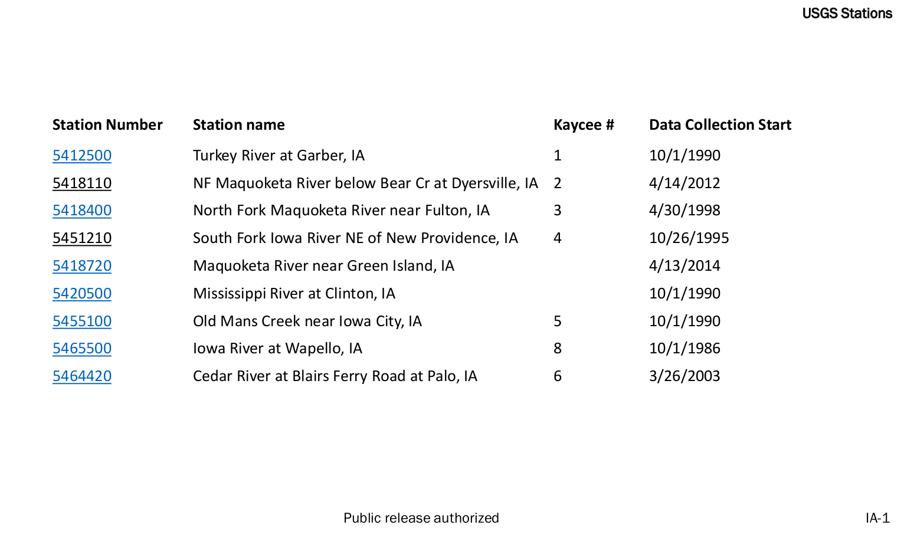
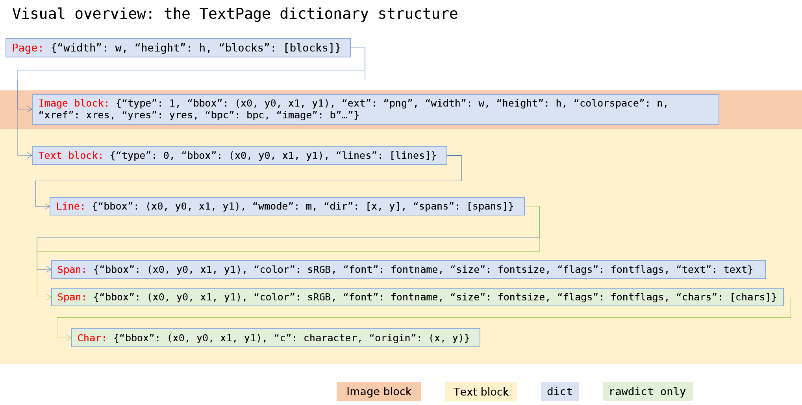
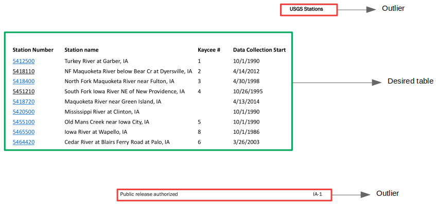
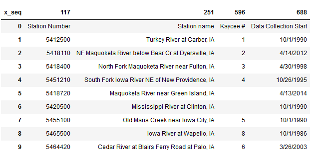

Most business documents are distributed or available only in PDF format.
Tables contain valuable data for further processing or to join with
other data elements or tables. Many tools exist to extract the textual
information, but extracting tables is a different story.

While PDF documents display tables with different formats, but don’t
have an underlying structure like HTML and LaTex do. They may or may not
be presented with well-defined column and row separators. Cell may be
separated with visible lines or just whitespace. While the human eye is
able to discern that these are tables, it is difficult for programs to
make the same association.

Even early versions of HTML supported a table constructs that can coded
via a series of tags such as &lt;table&gt;, &lt;tr&gt; (row), and
&lt;td&gt; (column) tags. LaTex uses a something similar -
\\begin{table}, \\begin{tabular}, \\end{tabular}, and \\end{table} tags
to describe a table.

For example, a table like this would be coded as follows
<table>
  <thead>
    <tr>
      <th></th>
      <th>HTML</th>
      <th>LaTex</th>
    </tr>
  </thead>
  <tbody>
    <tr>
      <td>
      <table border="solid 1px gray">
            <tr><td>A11</td><td>A2</td><td>A3</td></tr>
            <tr> <td>B1</td><td>B2</td><td>B3</td></tr>
            <tr> <td>C1</td> <td>C2</td> <td>C3</td></tr> 
      </table>
      </td>
      <td>
          <font size="2" face="Courier New" >
          &lt;table&gt;<br>                           
            &lt;tr&gt;<br>
            &lt;td&gt;A1&lt;/td&gt;&lt;td&gt;A2&lt;/td&gt;&lt;td&gt;A3&lt;/td&gt;<br>
            &lt;td&gt;B1&lt;/td&gt;&lt;td&gt;B2&lt;/td&gt;&lt;td&gt;B3&lt;/td&gt;<br>
            &lt;td&gt;C1&lt;/td&gt;&lt;td&gt;C2&lt;/td&gt;&lt;td&gt;C3&lt;/td&gt;<br>
            <br>&lt;/tr&gt;            
          <br>&lt;/table&gt;
          </font>
      </td>
      <td>
      <font size="2" face="Courier New" >
      <div class="latex_code">
      \begin{table}[]<br>
\begin{tabular}{|l|l|l|}<br>
\hline<br>
A1 & A2 & A3 \\ \hline<br>
B1 & B2 & B3 \\ \hline<br>
C1 & C2 & C3 \\ \hline<br>
\end{tabular}<br>
\end{table}<br>
    </div>
    </font>
      </td>
    </tr>
  </tbody>
</table>

PDF documents have no discernible tags to target for extraction. Line
separators are Graphics and span a single cell. Text is rendered in
graphic boxes that may or may not be associated with one another, even
within a row or a column.

# Tools used and problem
I use python for all my Data Science and NLP activities. [***PyPDF2***](https://pypi.org/project/PyPDF2/), [***tabula***](https://tabula-py.readthedocs.io/en/latest/),
[***PDFMiner***](https://pypi.org/project/pdfminer/), and [***PyMuPDF***](https://pypi.org/project/PyMuPDF/) are some of the libraries that can read, extract text from, and manipulate PDF files.
Each of them is useful for different purposes. ***tabula*** specializes in retrieving table data from PDF documents and is able to do 
so with many tables in many different formats.

***tabula*** is capable of identifying and extracting content from
tables with good line separators. However, when table content is only
separated by white space, it is not able to find the structure. For
example,


We’ll look at one technique I developed to read a table like the one
above.

# Libraries needed
For this exercise, I used the following libraries

```
pandas (v 0.24.2)
numpy (v 1.16.4)
tablula (2.0.4)
sklearn (v 0.21.2)
fitz (part of PyMuPDF v 1.16.8)
```
These were installed and run on Windows 10 with Python 3.7.3.

# Approach

### Imports

```python
import pandas as pd
import numpy as np
import os
import fitz
```

### Read the PDF

    1.  Use ***fitz*** to open the file and read all the pages
    2.  For the page that has the table in it, get the text content as
        text blocks
        
fitz returns page content in a nested dictionary. A page contains Text Blocks, then lines. Lines contain spans. This image from the *pymupdf* documentation explains it best.
<figure>
    
    <figcaption>Source: <a href="https://pymupdf.readthedocs.io/en/latest/_images/img-textpage.png">https://pymupdf.readthedocs.io/en/latest/_images/img-textpage.png</a></figcaption>
</figure>    

```python 
doc = fitz.open(pdf_file)
pages = [p for p in doc.pages()]

curr_page = 0 # fitz pages are 0-based indexed

page = pages[curr_page]
page_dict = page.getText('dict')

blocks = [page_dict['blocks'][i] for i in np.arange(len(page_dict['blocks']))]
lines = [blocks[line]['lines'] for line in np.arange(len(blocks))]
spans = [s for s in itertools.chain(*[s for s in [lines[l] for l in np.arange(len(lines))]])]
```
Blocks are returned as list of tuples. The tuples have both position information as well as the actual text. For example, a block looks like
`(251.98, 156.13, 416.3181, 172.09, Turkey River at Garber, IA)`. These values correspond to `x0, y0, x1, y1`, `lines in block`).

For example, the block on the top right is represented by `(834.77, 18.9123, 920.8614, 34.8307, USGS Stations)`

`(x0, y0)` represent the top left corner, while `(x1, y1)` is the lower right corner. 
Together they form the bounding box for the block.

### Organize the blocks into a DataFrame to ease manipulation
``` python
bblock_data = pd.DataFrame(data=[[s['spans'][0]['bbox'][0]
                                 ,s['spans'][0]['bbox'][1]
                                 ,s['spans'][0]['bbox'][2]
                                 ,s['spans'][0]['bbox'][3]
                                 ,s['spans'][0]['text']
                                 ] for s in spans
                                ]
                          ,columns=['x0', 'y0', 'x1', 'y1', 'line']
                         ).sort_values(['y0', 'x0'])
```
We now have a DataFrame that is easy to manage.

| **x0**   | **y0**   | **x1**   | **y1**   | **line**| 
|:-----:|:----------:|:----------:|:----------:|:----------|
|834.77|18.9123|920.8614|34.8307|USGS Stations|
|117.89|126.752|223.1841|142.736|Station Number|
|251.98|126.752|340.4421|142.736|Station name|
|596.81|126.752|654.6569|142.736|Kaycee #|
|688.13|126.752|824.6923|142.736|Data Collection Start|
|117.89|156.13|174.2192|172.09|5412500|
|251.98|156.13|416.3181|172.09|Turkey River at Garber, IA|
|596.81|156.13|604.8991|172.09|1|
|688.13|156.13|756.7078|172.09|33147|
|117.89|182.53|174.2192|198.49|5418110|
|251.98|182.53|582.2661|198.49|NF Maquoketa River below Bear Cr at Dyersville, IA|


### Group blocks into rows and columns

We can use the positional information, especially (x0, y0) coordinates to organize the blocks into rows and columns. Rows can be created
using the vertical separator, y0 and columns using x0. However, the blocks are not always aligned exactly. Y coordinates values will vary
by small amounts, as will the x coordinates.

One way to align blocks in either axis would be to round the values to
the point where they are the same. Some numbers may need to be rounded
up, while others rounded down. The process would have to be iterative
and there is no set rules for when to stop. We need a different way to
do this.

The answer is ***clustering***. We  let clustering algorithms do the heavy lifting of identifying blocks that go together.

### Cluster using DBSCAN
DBSCAN is a good algorithm to use as we don’t now the number of lines
that the page contains. Unlike K-Means, it does not require the user
to predetermine the number of clusters it should split the data into.
The algorithm is based on the concept of differentiating high density
areas from low density areas. In general, it does not care about the
shape of the cluster.

The ***sklearn*** library has an implementation of DBSCAN and its
signature is

|     Parameter                |  Description |
|---------------------|-----------------------------------------------------------------------------------------------------------------------------------------------------------------------------------------------------------------------------------------------------------------------------------------------------------------------------------------------------------------------------------------------------------------------------------------------------------------------------|
| eps=0.5             | Maximum distance between two samples for one to be considered as in the neighborhood of the other.<br>When it is too small, the points are in different clusters and when it is large, clusters are usually large and encompass potentially smaller ones.                                                                                                                                                                                                                                                                                                                          
| min_samples=5      | Controls the algorithms’ tolerance towards noise. This parameter indicates there are as many other samples from a core sample in the cluster within a distance of eps                                                                                                                                                                                                                                                                                                    |
| metric='euclidean' | Used to calculate distance. Options are *cityblock*, *cosine*, *euclidean*, *l1*, *l2*, *manhattan*, from *sklearn* and 17 others from *scipy.spatial.distance*. See [*sklearn.metrics.pairwise_distances*](https://scikit-learn.org/stable/modules/generated/sklearn.metrics.pairwise_distances.html#sklearn.metrics.pairwise_distances) for all the ones that are available for use. We could also pass in precomputed values by setting this parameter to *precomputed* |
| metric_params=None | Additional parameters for the distance function and can be passed in as a dict.                                                                                                                                                                                                                                                                                                                                                                                             |
| algorithm='auto'   | Algorithm used by the *NearestNeighbors* module to compute pointwise distances and find nearest neighbors. Options are *auto*, *ball_tree*, *kd*_*tree*, *brute*.                                                                                                                                                                                                                                                                                                         |
| leaf_size=30       | Leaf size passed to *BallTree* or *cKDTree*.                                                                                                                                                                                                                                                                                                                                                                                                                                |
| p=None             | Power of the *Minkowski* distance metric (found in *scipy.spatial.distance* ).                                                                                                                                                                                                                                                                                                                                                                                              |
| n_jobs=None        | The number of parallel jobs to run                                                                                                                                                                                                                                                                                                                                                                                                                                          |


```
cluster_model = DBSCAN(eps = 0.5, min_samples = 0, metric ='manhattan')
cluster_model.fit(_data[y0].values)

block_data['cluster_id'] = cluster_model.labels_
```

Using ```ep = 0.5``` yielded the best results. I chose ```min_samples = 0``` to
indicate that some lines may only have the core element. Most of them would have more than 1 row, but it is acceptable to have clusters with
just 1 element. Clustering on `y0` tells us how to group data elements in the vertical axis. By repeating the clustering process on `x0`, we can group data elements in the horizontal axis as well.

To maintain the sequence, we must use both the cluster ids and the spacial feature `(x0 or y0)`. From this we can derive a new sequential value for each axis.
```python
# Within each cluster, get the first value of the spatial column
x  = clustered_data[['cluster_id_x', 'x0']]\
                    .groupby(['cluster_id_x'])\
                    .first()\
                    .sort_values(['x0']).reset_index()

x['x_seq'] = np.arange(x.shape[0])

# Join the new data set with clustered_data to give us a new column
clustered_data = clustered_data\
                            .join(x.set_index(['cluster_id_x', 'x0'])
                                  ,how='left'
                                  ,on=['cluster_id_x', 'x0'])
# Fill the value down where they are missing
clustered_data[['x_seq', 'x0']] = clustered_data[['x0', 'x_seq']]\
                                    .sort_values(['x0', 'x_seq'])\
                                    .fillna(method='ffill')
```

To examine the results, let us transform the data a little and then pivot it to look like the page

```python
table = clustered_data.loc[:,['x_seq', 'y_seq','cluster_id_x', 'x0', 'y0', 'line']]\
                               .sort_values(['y_seq', 'x0'])\
                               .pivot(index='y_seq', columns='x_seq', values='line')\
                               .reset_index(drop=True)
```

**Results**<br/>
The table below shows that the blocks have neatly organized themselves
by the line they belong to.<br/>


|cluster_id_x|cluster_id_y|0|1|2|3|4|5|6|
|---|---|---|---|---|---|---|---|---|
|0|0|USGS Stations|||||||
|1|1||Station Number|Station name|Kaycee #|Data Collection Start|||
|2|2||5412500|Turkey River at Garber, IA|1|10/1/1990|||
|3|3||5418110|NF Maquoketa River below Bear Cr at Dyersville, IA|2|4/14/2012|||
|4|4||5418400|North Fork Maquoketa River near Fulton, IA|3|4/30/1998|||
|5|5||5451210|South Fork Iowa River NE of New Providence, IA|4|10/26/1995|||
|6|6||5418720|Maquoketa River near Green Island, IA||4/13/2014|||
|7|7||5420500|Mississippi River at Clinton, IA||10/1/1990|||
|8|8||5455100|Old Mans Creek near Iowa City, IA|5|10/1/1990|||
|9|9||5465500|Iowa River at Wapello, IA|8|10/1/1986|||
|10|10||5464420|Cedar River at Blairs Ferry Road at Palo, IA|6|3/26/2003|||
|11|11||||||Public release authorized|IA-1|


**Metrics**<br/>

|| X-Axis | Y axis |
|:---|---:|---:|
|Number of clusters | 7 | 12 |
|Average cluster size | 8 | 4 |
|Silhouette score | 0.927 | 0.976 |

The metrics indicate we have really well defined clusters. There are
12 lines in the page, not counting newlines within the table as
separate ones and most lines have 3 elements in them. I am confident
that the clustering algorithm found the right clusters


While we have really good results, we can do better. The page has header
and footer information that is not really related to the table. As they
are separated from the main table body positionally, we can use that
information to separate them from the main content.

### Remove outliers

<br/>
To exclude blocks that are outside the main table, we first determine the mean
and standard deviation of `x0` and `y0` values. If values fall more than
1.5 \* the standard deviation on either side of the mean, the value
would be an outlier. With a range of 1.5, the page header, footer were marked as outliers.

The process was<br/>
a) Calculate the mean and standard deviation of `x0` and `y0`<br/>
b) Locate points that fall outside of 1.5 \* standard deviation of the mean<br/>
c) Data points identified in Step 2 are the outliers

The technique was applied to both the x and y axis and outliers were
those that fell outside either of those ranges. So, a point too far to
the right or left of the page or too high or low on the page would be
flagged as outliers. From this exercise, the page header and footer
are too far from the other blocks and come out as outliers.

 After removing the outliers, I reran the DBSCAN algorithm. Set the
 column headers to Row 0 and we get the following table

<figure>
    
    <figcaption>Table extracted from page</figcaption>
</figure> 
<figure>
    
    <figcaption>Original page</figcaption>
</figure> 

### Issues and Conclusion
This was a good exercise that used the data from ***fitz*** to generate a table. It is not without its drawbacks as the simpler solution would be for ***fitz*** to detect tables where rows and/or columns were separated by space rather than lines. Some of the shortcomings are

1.  If the page has multiple tables, they may not be kept separate. We
    may have multiple tables collapsed into one. The trick maybe to run
    clustering again, maybe with an algorithm like K-Means where we
    specify that we want 2 or 3 clusters. By generating a cluster of
    clusters, we might be able to detect multiple tables in the same
    page.

2.  If the table is wrapped in the page, into multiple columns, the
    approach would not know that. We’d have a problem similar to the one
    above. Additional processing maybe necessary to highlight the fact
    that the table is wrapped around.

3.  If there isn’t enough separation between lines and/or columns, the
    content could be merged together with the previous row or column.

4.  The table on the sample page that I used did not have a caption. The
    close proximity of the caption would have put it in the table and
    would require additional processing to be identified as a caption.

This is an interesting and novel approach to detecting clusters of text
in a page. I hope you find it inspirational to try out-of-the box
techniques to solving problems. Feedback is appreciated at
[*anandologist@gmail.com*](mailto:anandologist@gmail.com).
